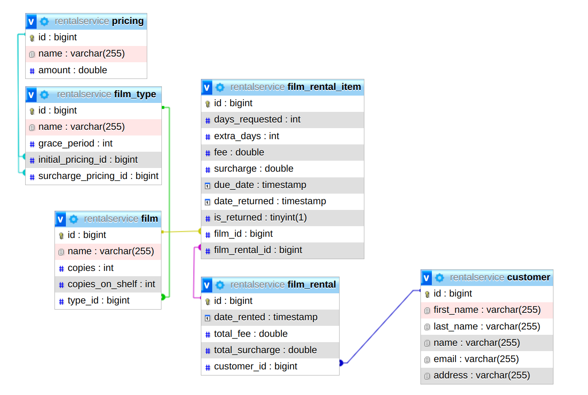

# READ ME

## DOCKER

#### To start up service using docker, simply run

```
docker compose up
```

## Swagger

After start up, [Open in swagger](http://localhost:2024/swagger-ui/index.html) to test apis.

Payload to test with example in assessment:

```
{
	"customerId": 1,
	"items": [
		{
			"filmId": 1,
			"daysRequested": 1
		},
		{
			"filmId": 2,
			"daysRequested": 5
		},
		{
			"filmId": 3,
			"daysRequested": 2
		},
		{
			"filmId": 4,
			"daysRequested": 7
		}
	]
}
```

## MySQL

To connect to the mysql instance, run:

```
mysql -h 0.0.0.0 -P 33333 -u rentalservice -p
```

After the password prompt, type in password as the password

## Tables



Six tables were created to tackle this problem.

1. customer: stores information about customers renting films
2. pricing: stores information about how a film type should be priced
3. film_type: stores information about the type of movie
4. film: stores information on movies to be rented
5. film_rental: stores information about one or more films rented
6. film_rental_item: stores more information about about one or more films rented

The first four tables have been pre-filled with dummy data to ease your usage. Find data below:


## Important to note

- Service runs on port 2024 `:)`
- I couldnt run through all tests.
- In the FilmRental Integration tests, Ideally the method to create entity relationships would be in their own test classes and called from there. Just put them all because of time constraint

You may use this skeleton as a starting point for your solution. It contains a simple
Spring Boot web application written using Java 17 and built using Gradle.

## Requirements

You need to have Java JDK 17 installed on your machine and available on your path.

## Instructions

The application is built using Gradle, via the included wrapper (`gradlew`).

- To build the application, use `gradlew clean build`
- Any tests that you add under the `tests` folder can be run using `gradlew clean test`
- To run the application, use `gradlew bootRun`
